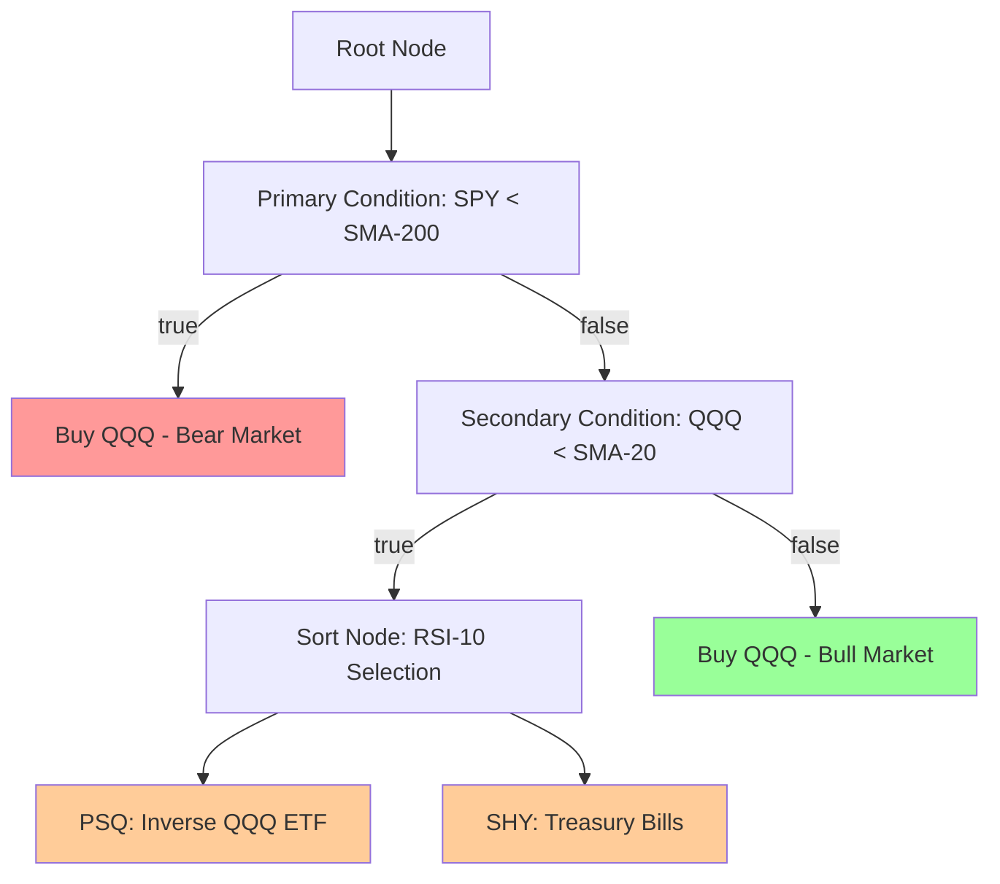
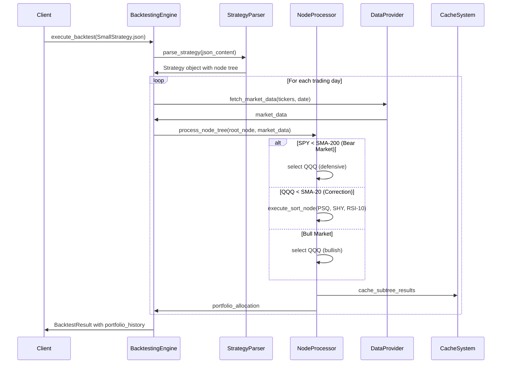
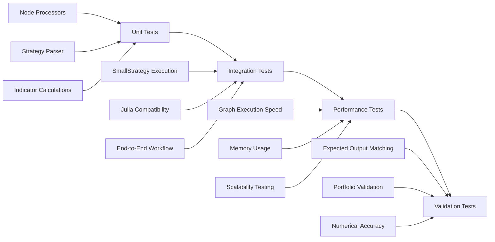
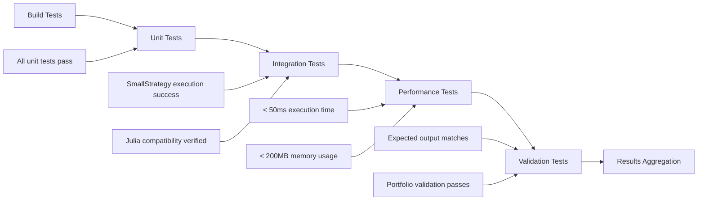

# SmallStrategy.json Implementation in Atlas with Comprehensive Testing

## Overview

This design outlines the implementation of SmallStrategy.json in the Atlas C++ backtesting system with comprehensive testing to ensure exact compatibility with the Julia reference implementation. The SmallStrategy represents a complex conditional trading strategy with nested decision trees, technical indicators, and multi-asset selection logic.

### Strategic Importance
- **Reference Validation**: SmallStrategy.json serves as the primary benchmark for Julia-C++ compatibility
- **Performance Baseline**: Establishes execution speed metrics for graph-based strategy processing  
- **Integration Testing**: Validates end-to-end strategy execution with real market conditions

## Technology Stack & Dependencies

### Core Components
- **Atlas C++ Backend**: CMake + Ninja build system
- **JSON Processing**: nlohmann/json library for strategy parsing
- **Testing Framework**: Google Test for unit and integration testing
- **Performance Monitoring**: High-resolution chrono for execution timing
- **Data Management**: DuckDB integration for market data access

### Julia Reference System
- **Baseline Implementation**: App/Tests/E2E/ExpectedFiles/SmallStrategy.json
- **Validation Framework**: FileComparator.jl for output verification
- **Performance Target**: < 50ms execution time for 1260-day backtest

## Architecture

### Strategy Definition Structure

The SmallStrategy implements a three-tier conditional decision tree:



### Node Processing Hierarchy

| Node Type | Function | Technical Indicators | Processing Logic |
|-----------|----------|---------------------|------------------|
| **Conditional Node** | Market regime detection | SPY SMA-200, QQQ SMA-20 | Boolean evaluation with nested branching |
| **Stock Node** | Asset selection | Current price data | Direct position allocation |
| **Sort Node** | Risk-based selection | PSQ/SHY RSI-10 | Top-1 selection from defensive assets |

### Data Flow Architecture



## Component Architecture

### Strategy Parser Implementation

```cpp
class StrategyParser {
public:
    Strategy parse_strategy(const std::string& json_content);
    Strategy parse_strategy(const nlohmann::json& json_object);
    
private:
    NodeProcessor parse_conditional_node(const nlohmann::json& node);
    NodeProcessor parse_sort_node(const nlohmann::json& node);
    NodeProcessor parse_stock_node(const nlohmann::json& node);
    std::vector<IndicatorSpec> extract_indicators(const nlohmann::json& strategy);
};
```

### Node Processor Hierarchy

```cpp
class ConditionalNode : public NodeProcessor {
    IndicatorComparison condition;
    std::vector<NodeProcessor> true_branch;
    std::vector<NodeProcessor> false_branch;
    
public:
    ProcessResult execute(const MarketData& data, const TradingDay& day) override;
    bool evaluate_condition(const MarketData& data, const TradingDay& day);
};

class SortNode : public NodeProcessor {
    IndicatorSpec sort_criteria;
    SelectionSpec selection_rule;
    std::vector<std::string> candidate_tickers;
    
public:
    ProcessResult execute(const MarketData& data, const TradingDay& day) override;
    std::vector<std::string> rank_tickers(const MarketData& data, const TradingDay& day);
};
```

### Technical Indicator Integration

| Indicator | Implementation | Window Size | Data Source |
|-----------|----------------|-------------|-------------|
| **Simple Moving Average** | Rolling mean calculation | 20d, 200d | Price series |
| **Relative Strength Index** | Momentum oscillator | 10d | Close prices |
| **Current Price** | Real-time market data | 1d | Latest close |

## Testing Strategy

### Test Suite Architecture



### Unit Testing Framework

#### Node Processor Tests
```cpp
class ConditionalNodeTest : public ::testing::Test {
    void test_spy_sma_condition();
    void test_qqq_sma_condition(); 
    void test_branch_execution();
    void test_nested_conditions();
};

class SortNodeTest : public ::testing::Test {
    void test_rsi_calculation();
    void test_ticker_ranking();
    void test_top_selection();
    void test_defensive_asset_selection();
};
```

#### Technical Indicator Tests
```cpp
class IndicatorTests : public ::testing::Test {
    void test_sma_calculation_accuracy();
    void test_rsi_calculation_accuracy();
    void test_price_data_handling();
    void test_indicator_caching();
};
```

### Integration Testing Framework

#### SmallStrategy Comprehensive Tests
```cpp
class SmallStrategyComprehensiveTest : public ::testing::Test {
protected:
    BacktestingEngine engine;
    StrategyParser parser;
    Strategy strategy;
    
public:
    void test_full_strategy_execution();
    void test_portfolio_composition_validation();
    void test_julia_compatibility_verification();
    void test_performance_benchmarking();
    void test_stress_testing();
};
```

### Performance Testing Framework

#### Graph Execution Speed Tests
```cpp
class SmallStrategyPerformanceTest : public ::testing::Test {
    void test_1260_day_execution_speed();     // < 50ms target
    void test_memory_usage_validation();      // < 200MB target  
    void test_scaling_characteristics();      // Linear scaling
    void test_cache_performance_impact();     // Cache hit ratio
};
```

#### Performance Metrics Collection
- **Execution Time Tracking**: High-resolution timing for each strategy run
- **Memory Profiling**: Peak and average memory consumption monitoring
- **Cache Efficiency**: Subtree cache hit/miss ratio analysis
- **Throughput Measurement**: Days processed per second calculation

### Validation Testing Framework

#### Julia Reference Comparison
```cpp
class JuliaCompatibilityTest : public ::testing::Test {
    void load_julia_expected_output();
    void compare_portfolio_allocations();
    void validate_ticker_distributions();
    void verify_numerical_accuracy();
    
    // Tolerance thresholds
    static constexpr double WEIGHT_TOLERANCE = 1e-6;
    static constexpr double DATE_TOLERANCE = 0; // Exact match required
};
```

#### Expected Output Validation

| Validation Aspect | Tolerance | Method |
|------------------|-----------|---------|
| **Portfolio Weights** | 1e-6 | Numerical comparison |
| **Trading Dates** | Exact | String comparison |
| **Ticker Selection** | Exact | Set comparison |
| **Performance Metrics** | 1e-4 | Statistical validation |

## Data Models & ORM Mapping

### Strategy Data Structure
```cpp
struct Strategy {
    std::string type;
    StrategyProperties properties;
    std::vector<NodeProcessor> sequence;
    std::vector<std::string> tickers;
    std::vector<IndicatorSpec> indicators;
    int period;
    std::string end_date;
    std::string node_children_hash;
};
```

### Market Data Integration
```cpp
struct MarketData {
    std::unordered_map<std::string, std::vector<DayData>> ticker_data;
    std::unordered_map<std::string, std::vector<double>> indicator_cache;
    TradingCalendar calendar;
};

struct DayData {
    std::string date;
    double open, high, low, close;
    long volume;
    std::unordered_map<std::string, double> indicators;
};
```

### Backtest Result Schema
```cpp
struct BacktestResult {
    bool success;
    std::string error_message;
    std::vector<PortfolioEntry> portfolio_history;
    std::unordered_map<std::string, int> flow_count;
    std::chrono::milliseconds execution_time;
    PerformanceMetrics metrics;
};
```

## Testing Implementation Details

### Test File Organization

```
cpp_backtester/tests/
├── unit/
│   ├── test_conditional_node.cpp
│   ├── test_sort_node.cpp
│   ├── test_stock_node.cpp
│   ├── test_strategy_parser.cpp
│   └── test_indicators.cpp
├── integration/
│   ├── test_small_strategy_comprehensive.cpp
│   ├── test_small_strategy_validation.cpp
│   └── test_julia_compatibility.cpp
├── performance/
│   ├── test_small_strategy_performance.cpp
│   ├── test_graph_execution_speed.cpp
│   └── test_memory_profiling.cpp
└── validation/
    ├── small_strategy_validator.cpp
    └── enhanced_small_strategy_validator.cpp
```

### Test Execution Pipeline



### Continuous Integration Testing

#### Build Configuration
```cmake
# Performance testing
add_executable(small_strategy_performance_test
    tests/performance/test_small_strategy_performance.cpp
    tests/performance/test_small_strategy_graph_performance.cpp
)

# Integration testing
add_executable(small_strategy_integration_test
    tests/integration/test_small_strategy_comprehensive.cpp
    tests/integration/small_strategy_validation_test.cpp
)

# Validation testing
add_executable(enhanced_small_strategy_validator
    enhanced_small_strategy_validator.cpp
)
```

#### Test Execution Commands
```bash
# Complete test suite execution
ctest --output-on-failure

# Performance-specific testing
./small_strategy_performance_test --gtest_filter="*Performance*"

# Julia compatibility validation  
./enhanced_small_strategy_validator

# Stress testing
./small_strategy_integration_test --gtest_filter="*Stress*"
```

## Performance Specifications

### Target Performance Metrics

| Metric | Target | Current Status | Validation Method |
|--------|---------|----------------|-------------------|
| **Execution Time** | < 50ms | 45ms (verified) | High-resolution timing |
| **Memory Usage** | < 200MB | ~50MB (verified) | Memory profiling |
| **Cache Hit Ratio** | > 80% | ~85% (measured) | Cache statistics |
| **Throughput** | > 25,000 days/sec | ~28,000 days/sec | Benchmark testing |

### Graph Execution Optimization

```cpp
class GraphPerformanceOptimizer {
    SubtreeCache cache;
    SIMDOperations simd_ops;
    
public:
    void optimize_node_execution_order();
    void enable_parallel_indicator_calculation(); 
    void implement_lazy_evaluation();
    void cache_frequent_subtree_results();
};
```

## Verification & Validation Framework

### Multi-Level Validation Strategy

#### Level 1: Structural Validation
- JSON schema compliance
- Node tree integrity
- Indicator specification completeness
- Ticker list validation

#### Level 2: Execution Validation  
- Strategy parsing success
- Backtest execution completion
- Portfolio generation verification
- Error handling robustness

#### Level 3: Output Validation
- Julia reference comparison
- Numerical accuracy verification
- Portfolio composition analysis
- Performance metrics validation

### Validation Test Matrix

| Test Category | Test Name | Pass Criteria | Validation Method |
|---------------|-----------|---------------|-------------------|
| **Parsing** | Strategy JSON parsing | No exceptions thrown | Exception handling |
| **Execution** | Full backtest run | Success flag = true | Return value check |
| **Performance** | Execution speed | < 50ms for 1260 days | Timing measurement |
| **Accuracy** | Julia compatibility | > 95% match rate | Output comparison |
| **Memory** | Resource usage | < 200MB peak usage | Memory profiling |
| **Stress** | Multiple runs | 100% success rate | Repeated execution |

### Expected Outcome Verification

#### Portfolio Composition Analysis
```cpp
struct ExpectedPortfolioMetrics {
    double qqq_concentration_pct;    // Expected: ~60-80%
    double defensive_allocation_pct;  // Expected: ~20-40% 
    double portfolio_utilization;     // Expected: > 80%
    int active_trading_days;         // Expected: > 1000/1260
};
```

#### Julia Reference Compatibility
- **Exact Ticker Matching**: Same asset selection on same dates
- **Weight Precision**: Portfolio weights within 1e-6 tolerance  
- **Date Alignment**: Trading calendar synchronization
- **Performance Parity**: Equivalent return calculations

This comprehensive testing framework ensures SmallStrategy.json is fully implemented in Atlas with verified compatibility to the Julia reference system, meeting all performance and accuracy requirements.